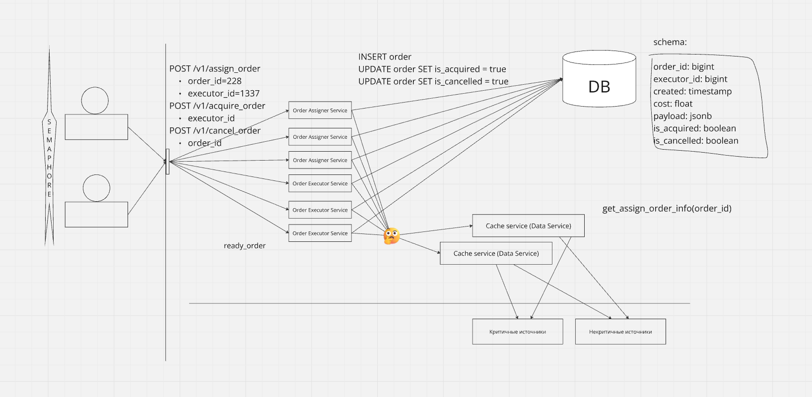

## Design schema



## Files and directory structure

`architecture` &mdash; contains all ADRs for this project

`cache-service` &mdash; source code of the microservice for
caching data sources (see [ADR-001](architecture/adr-001-cache-service.md))

`order-service` &mdash; source code of the microservice responsible
for assigning and aquiring of orders (see [ADR-002](architecture/adr-002-order-service.md))

`docker` &mdash; all the dockerfiles for this project, e. g. for `cache-service` and `order-service`

`infra` &mdash; everything needed for getting the project up in the cloud

`tests` &mdash; integration tests

`compose.yaml` &mdash; docker-compose file for local testing

### How to execute tests

```bash
go test -v ./tests/
```
1. (10) Сначала около 2-3 минут будет подниматься ScyllaDB (локально так долго по крайней мере) в рамках теста на то, что сервис может подняться

2. (11) Затем запустятся тесты на логику, проверяющие, корректно ли сервис обрабатывает запросы

3. (12) Тесты на корректное поведение кеша (минуту придется подождать, чтобы проверился тест на таймаут)

4. (19) Тест, завершающий работу сервиса


### How to start

```bash
docker compose build
docker compose up
# Подождать пока все поднимется (`docker exec -it scylla-node1 nodetool status` должно показать 3 хоста)

# Налили миграцию в базу
docker exec scylla-node1 cqlsh -f /mutant-data.txt

# Курим
curl -X POST 'http://localhost:5252/v1/assign_order?order-id=1&executor-id=1' -v
curl -X POST 'http://localhost:5252/v1/cancel_order?order-id=1' -v
curl -X POST 'http://localhost:5253/v1/acquire_order?executor-id=1' -v
```
